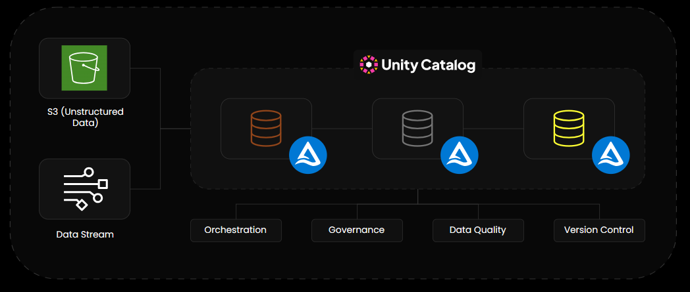

# Databricks E2E Project

End-to-end data engineering project simulating a small-size e-commerce company. Built on Databricks using modern DE tooling: Auto Loader, Spark Declarative Pipelines, Delta Lake, Unity Catalog, and Lakeflow Jobs.

- **Ingestion:** Auto Loader
- **ETL:** Spark Declarative Pipelines
- **Storage:** Delta Lake
- **Governance:** Unity Catalog
- **Orchestration:** and Lakeflow Jobs.

---

## Architecture



**Medallion Architecture** managed by Unity Catalog under the `e2e_databricks` catalog.

---

## Stack

| Component | Tool |
|---|---|
| Ingestion | Auto Loader (`cloudFiles`) |
| Pipeline | Spark Declarative Pipelines (DLT) |
| Storage | Delta Lake |
| Orchestration | Lakeflow Jobs |
| Governance | Unity Catalog |
| Data Quality | Pipeline Expectations |
| Version Control | GitHub |
| Deployment | Databricks Asset Bundles (DABs) |

---

## Data Sources

### Batch — S3
Six tables exported as yearly CSV files, simulating an ERP system:

| Table | Description |
|---|---|
| `customers` | One file per year, only customers registered that year |
| `products` | Single file, dimension table |
| `orders` | One file per year |
| `order_items` | One file per year, 1–5 items per order |
| `payments` | One file per year |
| `deliveries` | One file per year, only for shipped orders |

```
s3://bucket/raw/
├── customers/customers_2022.csv ... customers_2025.csv
├── products/products.csv
├── orders/orders_2022.csv ... orders_2025.csv
├── order_items/
├── payments/
└── deliveries/
```

### Streaming — Databricks Volume
Clickstream events written as JSONL micro-batch files by `event_generator.ipynb`, simulating a mobile/web app:

```
/Volumes/e2e_databricks/raw/storage/events/
└── events_20250101_120000_a1b2c3.jsonl   ← new file every N seconds
```

Event types: `page_view`, `add_to_cart`, `purchase`, `return_request`

---

## Dirty Data

Intentionally injected to simulate real-world ingestion problems and demonstrate Silver transformations:

| Table | Issues |
|---|---|
| `customers` | Mixed timestamp formats, ~3% duplicates, ~5% null email, ~2% invalid age |
| `orders` | Mixed `customer_id` format (`1042` vs `CUST_001042`), prices as strings (`$29.99`, `29,99`), ~5% duplicate order IDs, ~2% impossible dates (`order_date > shipped_date`) |
| `order_items` | ~3% null quantity, ~2% quantity = 0 |
| `payments` | ~5% double payment attempts, ~3% null method, ~2% partial amounts |
| `deliveries` | ~3% `delivered_at < shipped_at`, ~5% null carrier |
| `events` | ~6% duplicate events (mobile retry), ~8% out-of-order timestamps, inconsistent JSON schema between app v1 and v2, rotating `device_id` per user |

---

## Pipeline

### Bronze
Raw ingestion via Auto Loader. One table per entity, all years combined. No transformations — data is kept exactly as ingested from the source.

### Silver
Cleaned and typed tables. Key transformations:

- **Deduplication** — `ROW_NUMBER()` over `order_id` partitioned by `ingestion_time DESC`
- **Timestamp normalization** — `coalesce` over 4 known dirty formats → unified timestamp
- **customer_id normalization** — `regexp_extract` to strip `CUST_` prefix → cast to int
- **Price parsing** — strip `$`, replace `,` → `.`, cast to double
- **Event schema normalization** — unify v1/v2 JSON payload into consistent columns
- **Partitioning** — `silver_orders`, `silver_order_items`, `silver_events` partitioned by `year` and `month`

Invalid records are dropped via DLT Expectations and logged:


```python
@dlt.expect_or_drop("valid_age", "age BETWEEN 0 AND 120")
@dlt.expect_or_drop("valid_order_date", "order_date <= shipped_date")
@dlt.expect_or_drop("valid_quantity", "quantity IS NOT NULL AND quantity > 0")
@dlt.expect_or_drop("valid_stock", "stock >= 0")
@dlt.expect_or_drop("valid_delivery", "delivered_at >= shipped_at")
```

### Gold
Three materialized views serving different business audiences:

**`gold_customer_360`** — Marketing
- LTV (total spend per customer across completed orders)
- RFM segmentation: `VIP`, `Active`, `At Risk`, `Churned`
- Churn risk flag (no purchase in 90+ days)
- Return rate per customer

**`gold_product_performance`** — Product
- Gross and net revenue per product
- Margin rate, stock turnover
- Return rate per product

**`gold_daily_ops_summary`** — Operations
- GMV and average ticket per day per channel
- Order breakdown: completed / cancelled / disputed / refunded
- SLA %: share of shipments delivered within the estimated window

---

## Project Structure

```
e2e_databricks/                          # Data generation scripts
├── scripts/
│   ├── config.py                        # Shared ID pools and constants
│   ├── data_generator.ipynb             # Generates batch CSVs for S3
│   └── event_generator.ipynb            # Streaming producer (writes JSONL to Volume)

e2e_bundle/                              # Databricks Asset Bundle
├── resources/
│   ├── etl.pipeline.yml                 # SDP pipeline definition
│   └── main_job.job.yml                 # Lakeflow Job definition
└── src/E2E_ETL/
    ├── ingestion/
    │   ├── s3_ingest.py                 # Auto Loader ingestion from S3 (Bronze)
    │   └── stream_event_ingest.py       # Auto Loader ingestion from Volume (Bronze events)
    └── transformations/
        ├── silver_transformations.py    # Cleaning, deduplication, typing (Silver)
        └── gold_layer.sql               # Business aggregations (Gold)
```
---

## Orchestration

Single Lakeflow Job running the full DLT pipeline (Bronze → Silver → Gold). DLT resolves table dependencies internally — no need for one task per layer.

Alert on failure configured at the Job level.

---

## Setup

**Requirements:** Databricks workspace with Unity Catalog enabled, S3 bucket, Databricks CLI.

```bash
# Install Databricks CLI
pip install databricks-cli

# Deploy with DABs
databricks bundle deploy --target dev
databricks bundle run e2e_bundle
```

Or, deploy directly from the Databricks UI:
- Workspace → Create → Git Folder → Clone this repo → Create → Asset Bundle 

**Generate data:**
1. Upload `config.py` to your Databricks workspace
2. Run `data_generator.ipynb` to populate S3 with batch CSVs
3. Run `event_generator.ipynb` to start the streaming producer (runs continuously)
